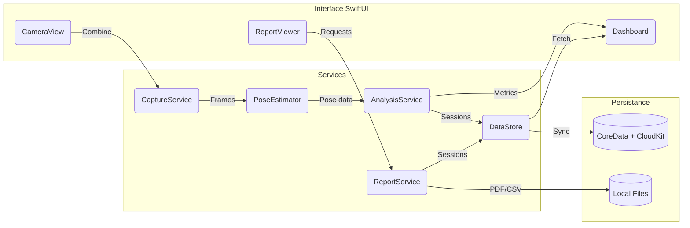

# Architecture de l'application iOS

## Vue d'ensemble

L'application cible un déploiement natif iOS (iOS 16 et ultérieur) pour iPhone 13
et modèles subséquents. Elle est construite autour de trois couches :

1. **Acquisition vidéo** – Gestion de la caméra, du pipeline d'images et du
   stockage temporaire.
2. **Analyse biomécanique** – Estimation de pose, calculs d'angles, détection de
   cycles, agrégation de métriques temporelles.
3. **Rapport et restitution** – Tableaux de bord en app, export PDF/CSV et
   moteur d'évaluation selon les normes ISO.

Chaque couche est implémentée avec des composants SwiftUI/Combine pour la
présentation et des services spécialisés pour le traitement des données.

## Modules principaux

### 1. Module Capture

* **Frameworks** : `AVFoundation` pour la capture vidéo et `Vision` pour le
  traitement image.
* **Fonctionnalités** :
  * Aperçu caméra en temps réel avec verrouillage de la mise au point.
  * Gestion du débit (30 fps recommandé) et de l'éclairage.
  * Enregistrement local sécurisé (CoreData + chiffrement facultatif).
  * Récupération des frames pour le moteur d'estimation de pose.

### 2. Module Pose & Cinématique

* **Moteur de pose** :
  * Option 1 : `VNDetectHumanBodyPoseRequest` (Vision) pour obtenir les 19 points
    du squelette Apple.
  * Option 2 : modèle Core ML (MoveNet, BlazePose) pour plus de précision et
    joints supplémentaires.
* **Filtrage & lissage** : filtre de Kalman ou filtre exponentiel pour réduire
  le bruit des coordonnées.
* **Calculs d'angles** :
  * Définition de segments (ex. épaule = vecteur tronc/bras supérieur).
  * Utilisation du produit scalaire pour dériver les angles plans.
  * Extension possible en 3D via ARKit si calibration multi-caméras disponible.
* **Cinématique temporelle** :
  * Calcul de la vitesse angulaire et du temps passé dans chaque plage de
    mouvement.
  * Détection des répétitions via transformée de Fourier discrète ou analyse de
    pics (algorithme de détection de zéro croisement).
  * Indexation de chaque cycle pour les rapports.

### 3. Module d'évaluation ergonomique

* Moteur de règles configurables pour appliquer les seuils ISO
  (voir `docs/ergonomic-analysis.md`).
* API interne `ErgonomicAssessmentService` exposant des fonctions :
  * `evaluateJointAngles(session: PoseSession)`
  * `computeRepetitionIndex(joint: JointType)`
  * `generateISOScore(session: PoseSession)`
* Stockage des résultats dans `CoreData` avec modèle `AssessmentSession`.

### 4. Module Rapport & Export

* Génération PDF via `PDFKit` avec insertion d'images clés, graphiques SwiftUI
  et synthèse des scores ISO.
* Export CSV/JSON pour analyses avancées.
* Partage sécurisé (AirDrop, Mail, Files) avec signature numérique optionnelle.

## Architecture logicielle

## Sécurité et confidentialité

* Traitement local sur l'appareil (pas de transmission cloud par défaut).
* Consentement de la personne filmée et suppression sécurisée des sessions.
* Conformité RGPD / Loi 25 (Québec) : stockage chiffré, anonymisation avant
  export.

## Extensibilité

* Points d'extension pour intégrer des capteurs externes (IMU Bluetooth).
* Plugin d'import vidéo hors ligne (analyser des vidéos existantes).
* API REST future pour synchronisation avec un portail web.

## Prérequis techniques

* Xcode 15+, Swift 5.9, iOS Deployment Target : 16.0.
* Tests unitaires avec `XCTest` pour le moteur de calcul.
* Pipelines CI (GitHub Actions) pour lint SwiftFormat et tests.

